<div align="center">

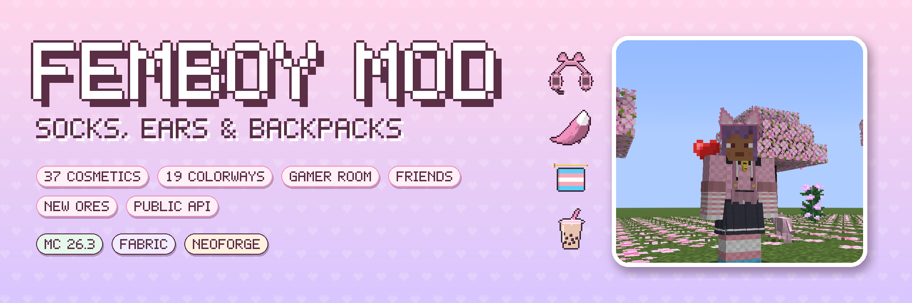

[](https://www.minecraft.net/)
[](https://fabricmc.net/)
[](https://neoforged.net/)
[](https://modrinth.com/mod/architectury-api)
[](LICENSE)
[](CHANGELOG.md)

[](https://modrinth.com/mod/femboy-mod)
[](https://www.curseforge.com/minecraft/mc-mods/femboy-mod)

**A cozy, meme-flavored fashion mod: programming socks, cat ears and fox tails, backpacks full of charms,<br>a gamer room, new friends, new gems — and a public API for addons.**

[Cosmetics](#cosmetics--outfits) • [Drip](#drip-sets--style-points) • [Backpacks](#backpacks--charms) • [Snacks](#byte-energy--snacks) • [Gamer Room](#gamer-room) • [Friends](#friends) • [Ores](#ores--gems) • [Mobs](#meme-mobs) • [Servers & API](#servers--addons) • [Installation](#installation)

</div>

---

## About

**Femboy Mod** lets you dress up. Ten cosmetic slots that live next to your armor, dozens of clothes and accessories in any color, pride flags and shimmering glitter, and a little game around looking good: your **Drip Level** grows with every piece, full sets give bonuses, the Fashion Critic judges you mid-fight and the whole server competes at the Vibe Check Scanner.

It's SFW and meme-flavored — socks = coding skill, energy drinks, "btw" — with no third-party brands and no flashing effects.

**Languages:** English, Русский, Español, Deutsch, Français, Português (Brasil), Nederlands, Svenska, 日本語, 简体中文

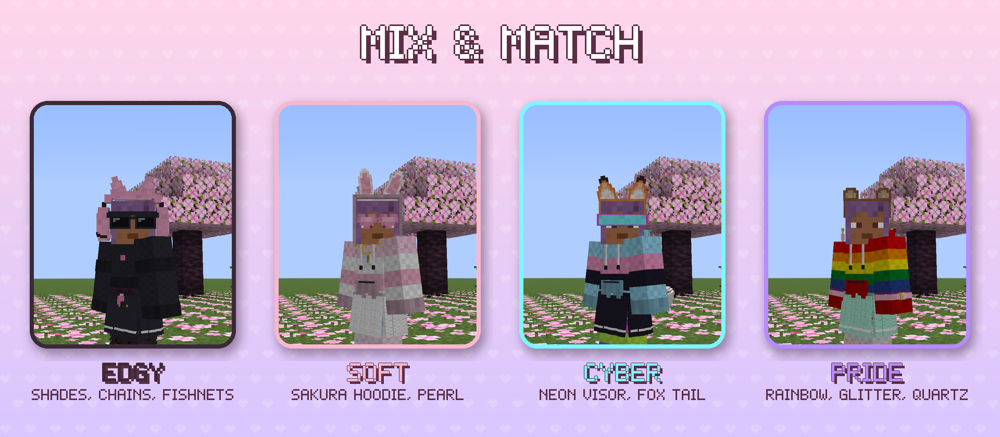

---

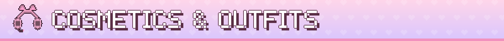

## Cosmetics & Outfits

Ten **cosmetic slots**, separate from armor, shown to everyone on the server:

| Slot | What goes there |
|---|---|
| Head | cat, fox, bunny, bear and wolf ears · cat-ear headphones · 10 hair clips |
| Face | heart glasses · dark shades · cyber visor · rose quartz earrings |
| Neck | UwU choker · moonstone pendant |
| Top | oversized hoodie · cat-ear hoodie · crop sweater |
| Hands | striped mittens · arm warmers · nail polish · rose quartz bracelet |
| Bottom | pleated skirt |
| Waist | belt chains |
| Legs | programming socks · fishnet tights |
| Tail | a fluffy fox-style tail that sways and curls |
| Back | backpacks with charms |

- **Every piece can be dyed** in a crafting grid — plus **19 colorways**: pride flags, glitter, pearl, neon and four exclusives you can only buy from the Wandering Cosplayer
- **Hide any piece** with the eye in its slot; it stays worn and keeps its bonus
- **Armor doesn't cover your look** — armor under your outfit is hidden (it still protects); toggle each piece auto / hide / show
- **First person too** — hoodie sleeves, mittens, arm warmers and nail polish on your hand
- **Outfit presets** — save up to five looks and switch in one click (also at the Wardrobe block)
- **Shift-click** a cosmetic in your inventory to wear it; a slot panel sits right next to the vanilla inventory

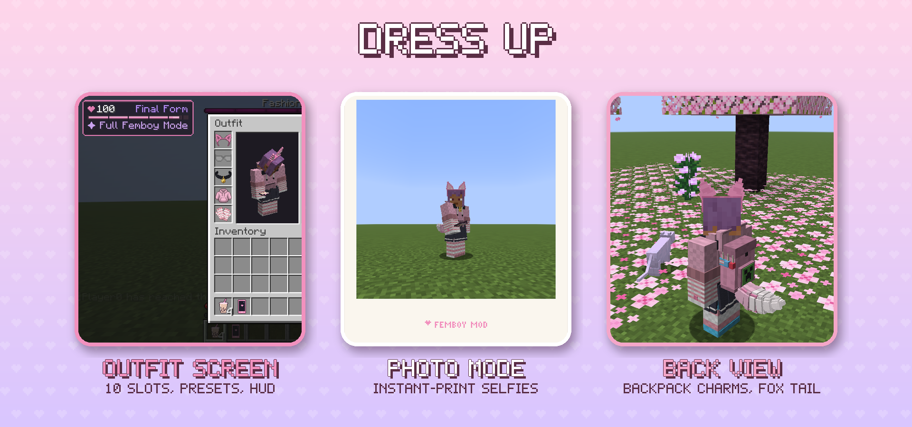

---

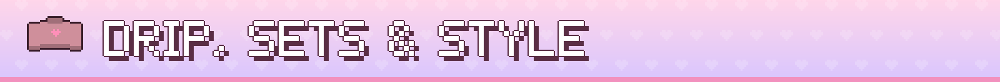

## Drip, Sets & Style Points

- **Drip Level** — every piece adds Drip, matching colors add more; a compact **Femboy Level** panel in the corner shows your tier, from *Just a Guy* to *Final Form*
- **Set bonuses** — *Full Femboy Mode* (ears + hoodie + skirt + legwear): a bit of speed, heart particles and small animals that follow you · *Crystal Clear* (rose quartz earrings + bracelet): Haste
- ✿ **Style Points** — earned for wearing sets, impressing the critic, new pieces in your collection, the rubber duck and the daily vibe check; trade them for **Style Coupons**, the currency of the Thrifter and the Cosplayer
- **Collection** — every piece you've ever worn counts (23/37…)
- **Advancements** — *Programming Socks Equipped*, *Drip: Maximum*, *Can't Decide What to Wear*, *Ready to Deploy*, *Battlestation*, *Immaculate Vibes* and more

---

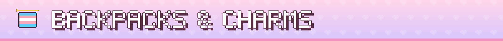

## Backpacks & Charms

- **Canvas → Leather → Netherite** backpacks (1–3 rows) — upgrades keep everything inside; netherite doesn't burn
- Worn in the back slot, opened with **B**; they can't go inside each other (tested against dupes)
- Hang up to **three charms** on the side: shark plush, cat paw, heart pin, energy can and **pride flag badges** (11 flags, crafted from dyes) — each with a small bonus

---

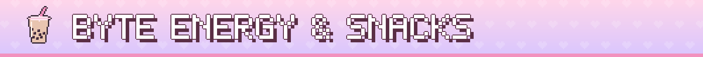

## Byte Energy & Snacks

- **Byte Energy** in four flavors — caffeine stacks up: first you're fast, then you're jittery, then comes the crash
- **Bubble tea** with 7 surprise flavors (taro, matcha, mango, lychee…) — each cup is a random buff
- **Strawberry milk** calms the jitters and cancels the crash · **mochi** · **onigiri**

---

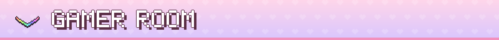

## Gamer Room

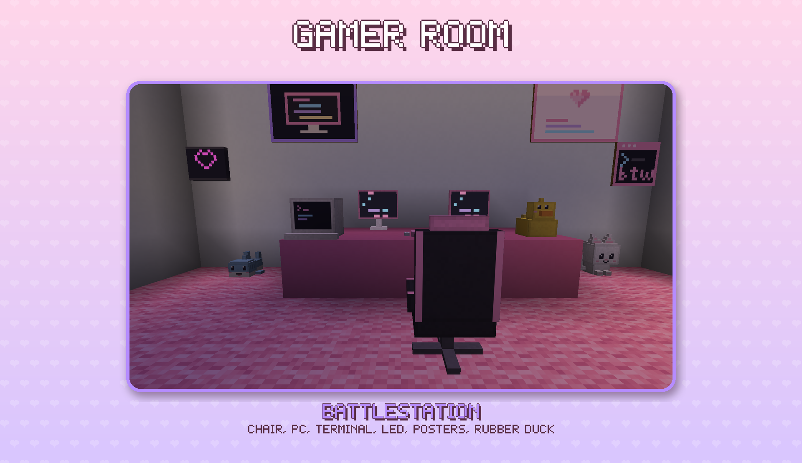

- **Gamer Chair** — sit down and slowly heal; the better your **setup rating** (up to ★★★★★★: screen, keyboard, lights, comfort, rubber duck, posters) the faster
- **Pink Monitor** with scrolling code · ⌨ **Clacky Keyboard** ·  **Terminal** — a crafting table that reminds you, btw, that you use Terminal
- **LED Strip** — four colors and a slow rainbow (never strobes) ·  **Moonstone Night Light** ·  **Neon Signs** (heart / cat / btw)
- **Rubber Duck** — explain your code to it: a meme answer, a bit of XP and *Insight* (faster digging)
- **20 posters** in 1×1, 1×2 and 2×2
- **Phone** — Photo Mode takes a selfie as an instant print with the mod's watermark

---

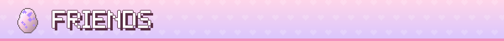

## Friends

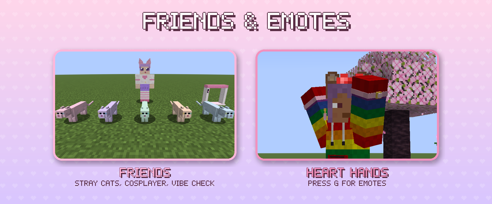

- **Stray Cats** in five pastel coats — tame them with fish; they sleep on your bed and bring small gifts in the morning
- **Wandering Cosplayer** — a rare travelling trader with colorways found nowhere else (Sakura, Starlight, Cyber Pastel, Witchy)
- **Emotes** on **G** — wave, peace, heart hands; everyone around sees them
- **Vibe Check Scanner** — step in, get your vibe (0–100 %) and a place on the **server leaderboard**

---

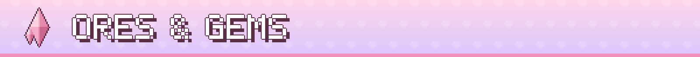

## Ores & Gems

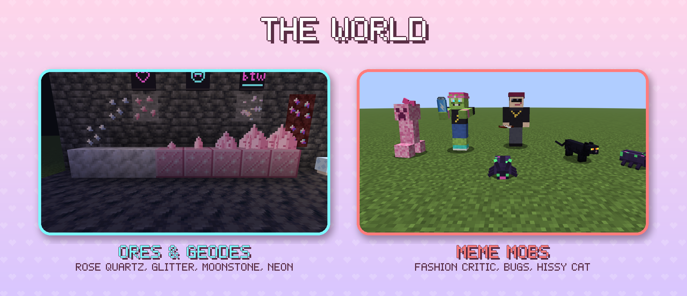

| Ore | Where | Used for |
|---|---|---|
| **Rose Quartz** | mountains, windswept hills, lush & dripstone caves | earrings, bracelet, furniture, quartz blocks |
| **Glitter** | flower biomes | the shimmering **glitter** colorway |
| **Moonstone** | deep deepslate, glows faintly | moonstone pendant (night vision at night), **pearl** colorway, night light |
| **Neon Quartz** | the Nether, glows | neon signs, cyber visor, **neon** colorway |
| **Rose quartz geodes** | underground, like amethyst | budding rose quartz grows crystals in four stages |

---

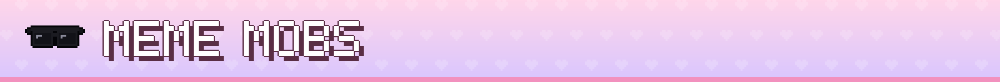

## Meme Mobs

Drip matters in a fight: the better you look, the less they hurt.

- **Bugs** swarm at night ·  **Caffeinated Zombies** shake with energy and hold a can · ⬛ **Hissy Cats** pounce from the dark forest
- **Fashion Critic** — a rare mini-boss that reviews your outfit mid-fight. Bad drip: you're slowed. Great drip — or dark shades — leaves it speechless. Drops the exclusive wolf ears
- **Pink Creeper** — bursts into confetti and hearts, never breaks blocks

---

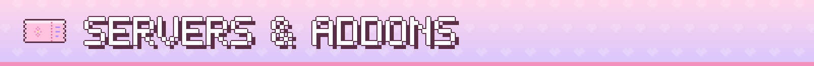

## Servers & Addons

**Game rules** — change them in game with `/gamerule`:

| Rule | Default | What it does |
|---|---|---|
| `femboymod:style_points` | `true` | players earn Style Points |
| `femboymod:set_bonuses` | `true` | set bonuses apply |
| `femboymod:keep_cosmetics` | `false` | cosmetics stay on when you die |
| `femboymod:allow_hidden_armor` | `true` | players may hide armor under their outfit (turn off on PvP servers) |
| `femboymod:drip_pvp_percent` | `0` | PvP: % more damage per Drip tier above the victim |

**Config** — `config/femboymod-common.json` (balance, mobs, furniture, style points, vibe check, friends) and `femboymod-client.json` (HUD panel, RGB animations, physics, UwU chat); in game via Mod Menu or the NeoForge mod list.

**Addon API** — a separate, documented `api` module: new cosmetics, slots, set bonuses, charms, colorways (with shimmer), effect types and conditions, renderers, chat transformers, a **player profile** for your own data (clans, ranks, points), **Style Points** and events (critic reviews, setup ratings, vibe checks, collection unlocks…). Most content is plain JSON in a data pack. Guide: [`docs/api/README.md`](docs/api/README.md), a working [example addon](example-addon).

**Compatibility** — Sodium + Iris, JEI (info pages), Mod Menu. See [`docs/compat.md`](docs/compat.md).

---

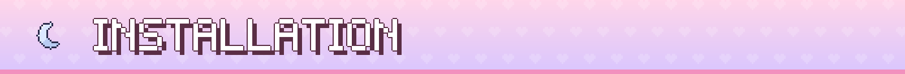

## Installation

| | Fabric | NeoForge |
|---|---|---|
| Minecraft | 26.3 | 26.3 |
| Loader | [Fabric Loader](https://fabricmc.net/) 0.19.5+ and [Fabric API](https://modrinth.com/mod/fabric-api) | [NeoForge](https://neoforged.net/) 26.3.0.16-beta+ |
| [Architectury API](https://modrinth.com/mod/architectury-api) | 22.0.2+ | 22.0.2+ |
| [GeckoLib](https://modrinth.com/mod/geckolib) | 5.5.7+ | 5.5.7+ |
| [JEI](https://modrinth.com/mod/jei), [Mod Menu](https://modrinth.com/mod/modmenu) | optional | optional |

1. Install the loader and the libraries above for Minecraft 26.3.
2. Download Femboy Mod from Modrinth, CurseForge or the releases.
3. Drop the `.jar` into `mods` — on **both** the client and the server.

---

## Development

```bash
./gradlew build                          # all modules + JUnit + server GameTests (Fabric and NeoForge)
./gradlew :fabric:runClient              # dev client (Fabric)
./gradlew :neoforge:runClient            # dev client (NeoForge)
./gradlew :fabric:runClientGameTest      # client screenshot tests
```

Architectury multi-loader: `api` / `common` / `fabric` / `neoforge` / `example-addon`, Java 25, Mojang mappings. Changes: [`CHANGELOG.md`](CHANGELOG.md).

---

## Credits & Notes

- **Author:** eliasnvx
- Screenshots are real in-game renders. The mod icon and some item icons started as AI drafts and were picked and cleaned up by hand; everything else is procedural or hand-made.
- SFW, no third-party brands or characters, no flashing effects. Pride content appears only as optional colorways and badges.

## License

[MIT](LICENSE) © eliasnvx

<div align="center">

**Made with love for everyone who likes to dress up**

</div>
